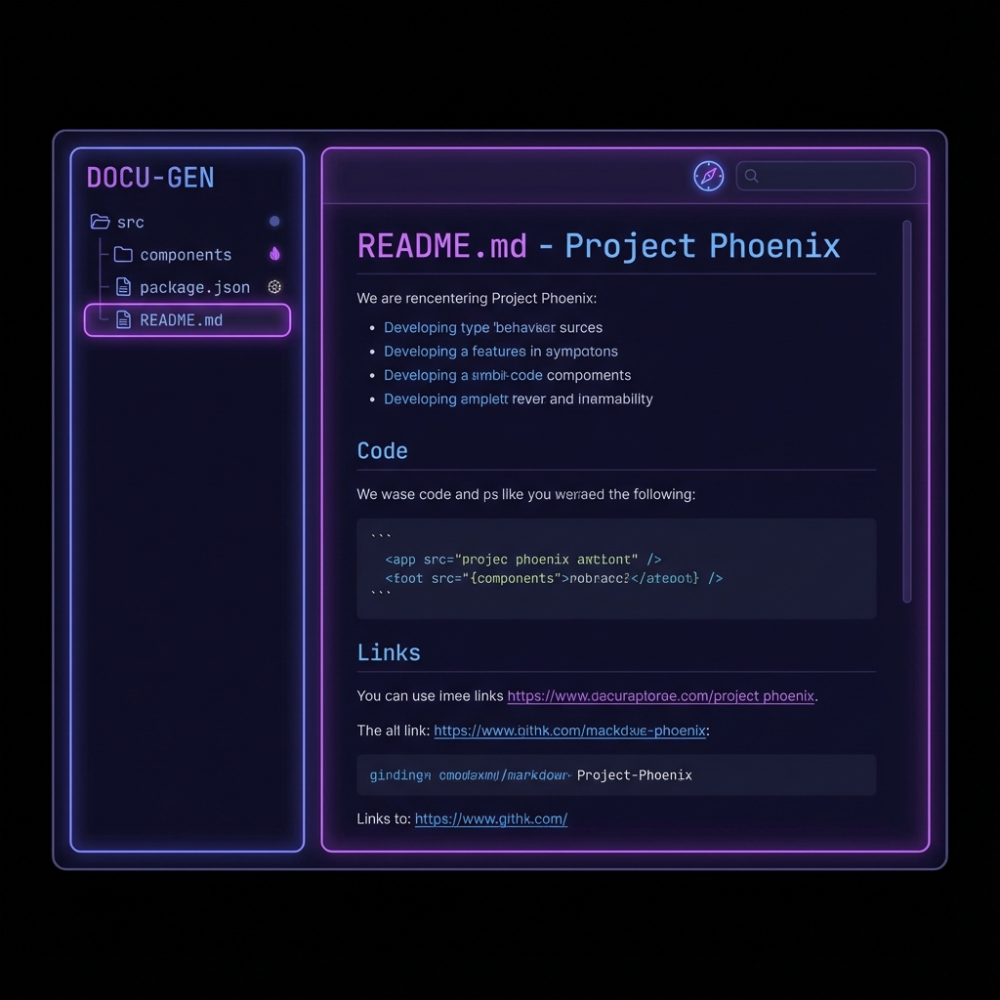

# 📘 AI Documentation Auto-Maintainer

> Auto-generate and maintain documentation directly from your GitHub repositories.

[](https://kartikeykumar.com/tools/doc-maintainer/)
[](https://react.dev)
[](https://typescriptlang.org)
[](https://vitejs.dev)



## ✨ Features

- **GitHub Integration**: Connect any public repository (or private with token).
- **Auto-Scanner**: Fetches file structure and identifies key project files.
- **Smart Generation**: Uses AI (Gemini/GPT-4) to read code and write docs.
- **Multiple Modes**:
  - 📝 **README Generator**: High-level overview, installation, usage.
  - 🔌 **API Reference**: Detailed class/function documentation.
  - 🔄 **Doc Updater**: (Coming Soon) Update existing docs based on code changes.
- **Privacy First**: API keys and tokens are stored in your browser's local storage.

## 🚀 Quick Start

### Prerequisites
- Node.js 18+
- npm or yarn

### Installation

```bash
# Clone the repository
git clone https://github.com/kartikeykumar09/doc-maintainer.git
cd doc-maintainer

# Install dependencies
npm install

# Start development server
npm run dev
```

Open [http://localhost:5173](http://localhost:5173) in your browser.

### Usage

1. **Enter Repo URL**: Paste a GitHub repository URL (e.g., `facebook/react`).
2. **Select Files**: Choose the files you want the AI to analyze (e.g., `package.json`, `src/index.js`).
3. **Configure AI**: Click Settings to add your Gemini or OpenAI API Key.
4. **Generate**: Click "Generate" and watch your documentation appear!

## 🛠️ Tech Stack

| Component | Technology |
|-----------|------------|
| Framework | React 18 + TypeScript |
| Build Tool | Vite 5 |
| Styling | Vanilla CSS (Indigo/Neon theme) |
| Icons | Lucide React |
| AI | Gemini 1.5 Pro / GPT-4o |
| Syntax Highlighting | React Syntax Highlighter |

## 🤝 Contributing

Contributions are welcome! This tool is in Beta.

1. Fork the repository
2. Create a feature branch: `git checkout -b feature/amazing-feature`
3. Commit your changes: `git commit -m "Add amazing feature"`
4. Push to the branch: `git push origin feature/amazing-feature`
5. Open a Pull Request

## 📄 License

MIT License - build something awesome!

## 🙏 Acknowledgments

- Built by [Kartikey Kumar](https://kartikeykumar.com)
- Part of the [Free Developer Tools](https://kartikeykumar.com/tools) suite

---

**[🔗 Live Demo](https://kartikeykumar.com/tools/doc-maintainer/)** | **[🐛 Report Bug](https://github.com/kartikeykumar09/doc-maintainer/issues)**
